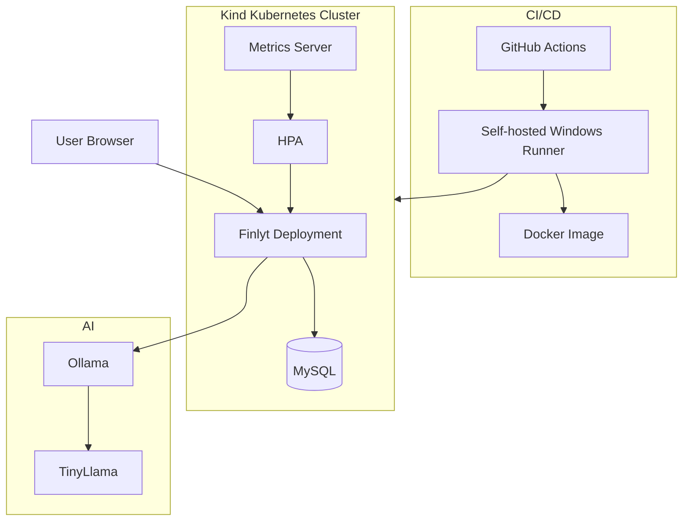

<div align="center">
Finlyt — DevSecOps Banking Application
A secure, containerized banking application built with Spring Boot 3, Java 21, MySQL, Docker, Kubernetes, Helm, GitHub Actions, and Ollama/TinyLlama.
This README documents the current Finlyt implementation. The repository also contains earlier AWS/DevSecOps work contributed by Samir Patel; those legacy AWS sections are intentionally not presented as the current implementation.


</div>

---
Overview
Finlyt is a Spring Boot based banking application with a DevSecOps-oriented deployment workflow.
The current implementation focuses on:
Banking accounts and balances
Transactions
Spring Security based authentication
MySQL persistence
Docker containerization
Kubernetes deployment
Helm packaging
GitHub Actions CI/CD
Self-hosted GitHub Actions runner on Windows
Kubernetes Horizontal Pod Autoscaler (HPA)
Kubernetes Metrics Server
Ollama + TinyLlama AI integration
Health monitoring through Spring Boot Actuator
Secure database schema validation in deployed environments
---
Current Architecture

---
Technology Stack
Layer	Technology
Backend	Java 21, Spring Boot 3
Security	Spring Security
Database	MySQL
ORM	Spring Data JPA / Hibernate
AI	Ollama + TinyLlama
Containerization	Docker
Orchestration	Kubernetes
Local Cluster	Kind
Packaging	Helm
CI/CD	GitHub Actions
Runner	Self-hosted Windows GitHub Actions Runner
Autoscaling	Kubernetes HPA
Metrics	Kubernetes Metrics Server
Monitoring Endpoint	Spring Boot Actuator
Build	Maven
---
Application Features
Authentication
Finlyt provides account-based authentication using Spring Security.
User registration
Login
Protected application pages
User-specific account information
Role-based `ROLE_USER` authority
Banking Operations
The application supports core banking operations such as:
Account creation
Balance management
Deposits
Withdrawals
Transaction records
Transaction history
Transactions are linked to their corresponding account using JPA relationships.
AI Integration
Finlyt integrates with Ollama and the `tinyllama` model.
Current configuration:
```properties
ollama.url=${OLLAMA_URL:http://localhost:11434}
ollama.model=tinyllama
```
The AI functionality is exposed through the application's chat functionality.
---
Project Structure
```text
Finlyt/
│
├── .github/
│   └── workflows/
│       └── ci-cd.yml
│
├── helm/
│   ├── Chart.yaml
│   ├── values.yaml
│   ├── charts/
│   └── templates/
│       ├── deployment.yaml
│       ├── hpa.yaml
│       ├── mysql.yaml
│       ├── service.yaml
│       └── _helpers.tpl
│
├── k8s/
│   ├── deployment.yaml
│   ├── hpa.yaml
│   ├── mysql.yaml
│   ├── secret.yaml
│   └── service.yaml
│
├── screenshots/
│   ├── 1.png
│   ├── 2.png
│   ├── ...
│   └── 26.png
│
├── src/
│   ├── main/
│   │   ├── java/com/example/bankapp/
│   │   │   ├── config/
│   │   │   ├── controller/
│   │   │   ├── model/
│   │   │   ├── repository/
│   │   │   └── service/
│   │   └── resources/
│   │       ├── static/
│   │       └── templates/
│   └── test/
│
├── Dockerfile
├── pom.xml
└── README.md
```
---
Docker
The application is packaged as a Docker image and deployed as a container.
Build locally:
```bash
docker build -t finlyt:latest .
```
Run locally:
```bash
docker run -p 8080:8080 finlyt:latest
```
The CI/CD workflow builds the application image before deployment.
---
Kubernetes Deployment
The current application is deployed to a Kubernetes cluster created using Kind.
Cluster:
```text
kind-finlyt-cluster
```
Application deployment:
```text
finlyt
```
MySQL deployment:
```text
finlyt-mysql
```
Useful commands:
```bash
kubectl get nodes
kubectl get pods
kubectl get deployments
kubectl get services
```
Expected application state:
```text
finlyt-xxxxx       1/1   Running
finlyt-xxxxx       1/1   Running
finlyt-mysql-xxxxx 1/1   Running
```
---
Kubernetes Configuration
The repository contains Kubernetes manifests under:
```text
k8s/
```
`deployment.yaml` — application deployment
`service.yaml` — application service
`mysql.yaml` — MySQL deployment
`secret.yaml` — Kubernetes secrets
`hpa.yaml` — autoscaling configuration
---
Helm
Finlyt also contains a Helm chart for Kubernetes deployment:
```text
helm/
├── Chart.yaml
├── values.yaml
└── templates/
    ├── deployment.yaml
    ├── hpa.yaml
    ├── mysql.yaml
    ├── service.yaml
    └── _helpers.tpl
```
Install:
```bash
helm install finlyt ./helm
```
Upgrade:
```bash
helm upgrade finlyt ./helm
```
Check:
```bash
helm list
```
---
Horizontal Pod Autoscaling
Finlyt uses Kubernetes HPA to automatically adjust application replicas based on CPU utilization.
Current configuration:
```text
Minimum replicas: 2
Maximum replicas: 5
Target CPU:       70%
```
Check HPA:
```bash
kubectl get hpa
```
A verified working state was:
```text
finlyt-hpa   Deployment/finlyt   cpu: 3%/70%   2   5   2
```
This means Kubernetes keeps at least two Finlyt pods running and can scale the deployment up to five replicas when CPU utilization increases.
---
Metrics Server
The HPA depends on Kubernetes resource metrics.
Metrics Server is deployed in the cluster and provides CPU and memory information.
Check:
```bash
kubectl get pods -n kube-system | findstr metrics-server
```
Check node metrics:
```bash
kubectl top nodes
```
Check pod metrics:
```bash
kubectl top pods
```
Verified example:
```text
NAME                            CPU(cores)   MEMORY(bytes)
finlyt-xxxxx                    3m           220Mi
finlyt-xxxxx                    4m           222Mi
finlyt-mysql-xxxxx              42m          431Mi
```
---
CI/CD Pipeline
The GitHub Actions workflow is located at:
```text
.github/workflows/ci-cd.yml
```
The pipeline automates the application build and deployment workflow.
High-level flow:
```text
Git Push
   ↓
GitHub Actions
   ↓
Build & Verify
   ↓
Docker Image
   ↓
Kubernetes Deployment
   ↓
Finlyt Pods
   ↓
HPA
```
The workflow uses the self-hosted Windows runner for the Kubernetes deployment stage.
---
Self-Hosted GitHub Actions Runner
The project uses a self-hosted GitHub Actions runner on Windows.
The runner is configured to access the Kind Kubernetes cluster through a dedicated kubeconfig:
```text
C:	ctions-runner\kubeconfig
```
The kubeconfig is configured for:
```text
kind-finlyt-cluster
```
Verification:
```powershell
kubectl --kubeconfig C:\actions-runner\kubeconfig config current-context
```
Expected:
```text
kind-finlyt-cluster
```
The runner service is managed through Windows Services.
---
Database
Finlyt uses MySQL with the database:
```text
bankappdb
```
The current database contains the main application tables:
```text
accounts
transactions
```
Accounts
The `accounts` table stores:
ID
Username
Password
Balance
Transactions
The `transactions` table stores:
ID
Amount
Type
Timestamp
Account relationship
The relationship is:
```text
Account 1 ──────── * Transactions
```
---
Database Schema Validation
The deployed application uses:
```properties
spring.jpa.hibernate.ddl-auto=validate
```
This ensures Hibernate validates the existing database schema instead of automatically changing the deployed schema.
For CI tests using a fresh MySQL database, the workflow can use:
```text
SPRING_JPA_HIBERNATE_DDL_AUTO=update
```
This keeps the deployed environment stricter while allowing the CI test database to initialize automatically.
---
Application Configuration
Important configuration is externalized through environment variables.
```properties
spring.datasource.url=jdbc:mysql://${MYSQL_HOST:localhost}:${MYSQL_PORT:3306}/${MYSQL_DATABASE:bankappdb}
spring.datasource.username=${MYSQL_USER:root}
spring.datasource.password=${MYSQL_PASSWORD:Test@123}

ollama.url=${OLLAMA_URL:http://localhost:11434}
ollama.model=tinyllama
```
For real deployments, credentials should be supplied through Kubernetes Secrets or another secure secret-management mechanism rather than committed credentials.
---
Actuator
Only the health endpoint is exposed:
```properties
management.endpoints.web.exposure.include=health
management.endpoint.health.show-details=when-authorized
```
This keeps the exposed Actuator surface intentionally limited.
---
Verification
Check application pods
```bash
kubectl get pods
```
Check deployment
```bash
kubectl get deployment finlyt
```
Check HPA
```bash
kubectl get hpa
```
Check metrics
```bash
kubectl top nodes
kubectl top pods
```
Check application logs
```bash
kubectl logs deployment/finlyt
```
Check MySQL
```bash
kubectl get pods | findstr mysql
```
---
Useful Kubernetes Commands
Restart application:
```bash
kubectl rollout restart deployment/finlyt
```
Check rollout:
```bash
kubectl rollout status deployment/finlyt
```
Check service:
```bash
kubectl get service
```
Port-forward the application:
```bash
kubectl port-forward service/finlyt 8080:8080
```
Check current image:
```bash
kubectl get deployment finlyt -o jsonpath="{.spec.template.spec.containers[0].image}"
```
Check image pull policy:
```bash
kubectl get deployment finlyt -o jsonpath="{.spec.template.spec.containers[0].imagePullPolicy}"
```
---
Screenshots & Documentation
The repository contains screenshots from different stages of the project's development under:
```text
screenshots/
```
Useful application, CI/CD, database, and deployment screenshots can be referenced from this directory.
Older AWS-specific screenshots and implementation details from the previous project phase are intentionally not used as the primary documentation for the current Kubernetes-based implementation.
---
Contribution & Project History
This repository contains work from multiple stages of the project.
The earlier version included AWS-based infrastructure and DevSecOps implementation such as AWS EC2, ECR, OIDC, Secrets Manager, and Docker Compose deployment.
Those earlier components were developed with help from Samir Patel and are part of the project's history.
The current Finlyt work documented above focuses on the newer implementation and improvements around:
Kubernetes
Kind
Helm
HPA
Metrics Server
GitHub Actions
Self-hosted runner
Kubernetes-based MySQL
Ollama/TinyLlama
Application configuration
CI/CD deployment
This README therefore distinguishes the earlier AWS implementation from the current project state rather than attributing all historical work to a single author.
---
Future Improvements
Potential future improvements include:
Production Kubernetes cluster deployment
HTTPS/TLS configuration
External secret management
Better observability and dashboards
Prometheus and Grafana integration
More comprehensive automated tests
Improved AI capabilities
Resource-based autoscaling
Production-grade database persistence and backups
---
Credits
Current Development
Guddu Yadav
Earlier Project Contributions
Samir Patel
Special thanks for the guidance and contributions that helped develop the earlier AWS/DevSecOps implementation.
---
<div align="center">
Finlyt
Spring Boot • Docker • Kubernetes • Helm • GitHub Actions • MySQL • Ollama
</div>