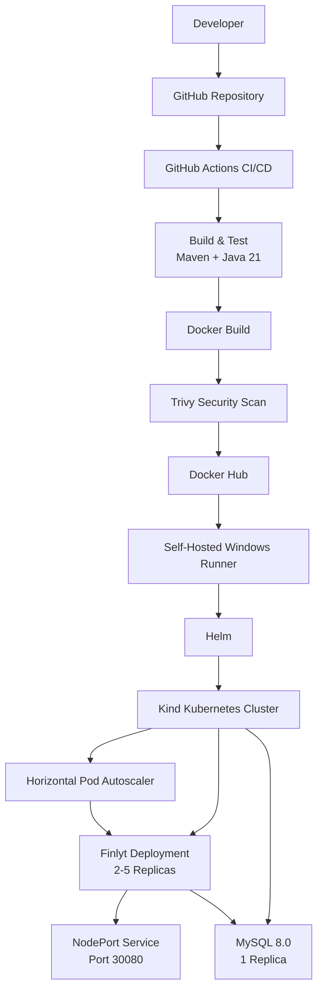

# Finlyt

## DevSecOps Banking Application

A containerized banking application built with Spring Boot and Java 21, deployed using Docker, Kubernetes, Helm, and an automated GitHub Actions CI/CD pipeline.

## Overview

Finlyt demonstrates a complete development-to-deployment workflow:

```text
Code
  ↓
GitHub
  ↓
GitHub Actions
  ↓
Build & Test
  ↓
Docker Image
  ↓
Trivy Security Scan
  ↓
Docker Hub
  ↓
Self-Hosted Windows Runner
  ↓
Kind Kubernetes Cluster
  ↓
Helm Deployment
  ↓
Kubernetes HPA
```

The application and MySQL database run inside Kubernetes, while Helm manages the Kubernetes deployment.

## Architecture



## Technology Stack

### Application

| Technology | Purpose |
|---|---|
| Java 21 | Programming language |
| Spring Boot | Backend framework |
| Spring Security | Application security |
| Spring Data JPA | Database access |
| MySQL 8.0 | Relational database |
| Maven | Build and dependency management |
| HTML/CSS/JavaScript | Frontend |

### DevOps

| Technology | Purpose |
|---|---|
| Git | Version control |
| GitHub | Source code hosting |
| GitHub Actions | CI/CD automation |
| Docker | Containerization |
| Docker Hub | Container image registry |
| Trivy | Container vulnerability scanning |
| Kubernetes | Container orchestration |
| Kind | Local Kubernetes cluster |
| Helm | Kubernetes package/deployment management |
| HPA | Automatic application scaling |

## Project Structure

```text
Finlyt/
│
├── .github/
│   └── workflows/
│       └── ci-cd.yml
│
├── helm/
│   ├── Chart.yaml
│   ├── values.yaml
│   ├── .helmignore
│   └── templates/
│       ├── deployment.yaml
│       ├── service.yaml
│       ├── mysql.yaml
│       ├── hpa.yaml
│       └── _helpers.tpl
│
├── k8s/
│   ├── deployment.yaml
│   ├── service.yaml
│   ├── mysql.yaml
│   ├── hpa.yaml
│   └── secret.yaml
│
├── screenshots/
├── src/
├── Dockerfile
├── pom.xml
├── mvnw
├── mvnw.cmd
├── .gitignore
└── README.md
```

> `k8s/secret.yaml` is kept local and excluded from Git to avoid committing credentials.

## Docker

Build locally:

```bash
docker build -t guddu3447/finlyt:latest .
```

Run:

```bash
docker run -p 8080:8080 guddu3447/finlyt:latest
```

Docker image:

```text
guddu3447/finlyt
```

Images are tagged using both `latest` and the Git commit SHA.

## Container Security

Trivy scans the Docker image for:

```text
CRITICAL
HIGH
```

severity vulnerabilities.

The current scan uses:

```yaml
ignore-unfixed: true
exit-code: '0'
```

so vulnerabilities are reported without automatically blocking the pipeline.

## Kubernetes

Finlyt runs on a local Kubernetes cluster created using Kind.

Check context:

```bash
kubectl config current-context
```

Expected:

```text
kind-finlyt-cluster
```

Check nodes:

```bash
kubectl get nodes
```

Check pods:

```bash
kubectl get pods
```

## Helm

Helm is used to package and deploy the Kubernetes resources.

```text
helm/
├── Chart.yaml
├── values.yaml
└── templates/
    ├── deployment.yaml
    ├── service.yaml
    ├── mysql.yaml
    ├── hpa.yaml
    └── _helpers.tpl
```

Validate:

```bash
helm lint helm
```

Render:

```bash
helm template finlyt helm
```

Install or upgrade:

```bash
helm upgrade --install finlyt helm
```

Check release:

```bash
helm list
```

## Horizontal Pod Autoscaling

Finlyt uses Kubernetes HPA.

```text
Minimum replicas: 2
Maximum replicas: 5
CPU target: 70%
```

Check:

```bash
kubectl get hpa
```

## Kubernetes Services

Finlyt is exposed using a NodePort service.

```text
Application Port: 8080
NodePort: 30080
```

Check:

```bash
kubectl get svc
```

The MySQL service remains internal:

```text
finlyt-mysql:3306
```

## MySQL

MySQL 8.0 runs as a Kubernetes deployment.

```text
Service: finlyt-mysql
Database: bankappdb
Port: 3306
```

Check:

```bash
kubectl get pods | findstr mysql
kubectl get svc finlyt-mysql
```

A readiness probe checks whether MySQL is accepting connections before Kubernetes considers the pod ready.

## CI/CD Pipeline

The workflow is defined in:

```text
.github/workflows/ci-cd.yml
```

### Continuous Integration

Every push to `main` triggers:

```text
Checkout
   ↓
Java 21 Setup
   ↓
Maven Setup
   ↓
Build & Test
   ↓
Docker Build
   ↓
Trivy Security Scan
   ↓
Docker Hub Login
   ↓
Docker Image Push
```

### Continuous Deployment

After CI succeeds:

```text
CI Job
  ↓
Self-Hosted Windows Runner
  ↓
Kubernetes Configuration
  ↓
kubectl Verification
  ↓
Helm Installation
  ↓
Helm Lint
  ↓
Helm Template
  ↓
Helm Upgrade/Install
  ↓
Rollout Verification
  ↓
Deployment Verification
```

The deployment runner uses:

```text
self-hosted
Windows
X64
```

The local Kind cluster is accessed using:

```text
C:\actions-runner\kubeconfig
```

## Self-Hosted GitHub Actions Runner

Runner:

```text
finlyt-windows
```

Labels:

```text
self-hosted
Windows
X64
```

The runner is installed as a Windows service and starts automatically.

The Kubernetes configuration is stored outside the Git repository:

```text
C:\actions-runner\kubeconfig
```

## Secrets

Sensitive Kubernetes credentials are intentionally excluded from Git.

Local secret file:

```text
k8s/secret.yaml
```

Example:

```yaml
apiVersion: v1
kind: Secret
metadata:
  name: finlyt-secret
type: Opaque
stringData:
  MYSQL_ROOT_PASSWORD: <your-password>
  MYSQL_PASSWORD: <your-password>
```

> Never commit real passwords, API keys, tokens, kubeconfig files, or private keys to Git.

## Useful Commands

### Pods

```bash
kubectl get pods
kubectl get pods -w
```

### Deployments

```bash
kubectl get deployments
kubectl rollout status deployment/finlyt
```

### Services

```bash
kubectl get svc
```

### HPA

```bash
kubectl get hpa
```

### Logs

```bash
kubectl logs deployment/finlyt
kubectl logs deployment/finlyt-mysql
```

### Helm

```bash
helm list
```

### Resource Usage

```bash
kubectl top pods
kubectl top nodes
```

## Operational Verification

After deployment, verify:

```bash
kubectl get pods
kubectl get deployments
kubectl get svc
kubectl get hpa
helm list
```

Required pods should show:

```text
READY 1/1
STATUS Running
```

Rollout should show:

```text
deployment "finlyt" successfully rolled out
```

## Screenshots

Project screenshots are available in:

```text
screenshots/
```

## Key DevOps Concepts Demonstrated

- Git-based development workflow
- CI/CD automation
- Maven build automation
- Automated testing
- Docker containerization
- Container vulnerability scanning
- Docker image versioning
- Docker Hub image publishing
- Kubernetes deployments
- Kubernetes services
- Kubernetes secrets
- Kubernetes readiness probes
- Horizontal Pod Autoscaling
- Helm chart development
- Helm-based deployment
- Self-hosted GitHub Actions runners
- Kind Kubernetes clusters
- Deployment rollout verification
- Kubernetes resource monitoring

## Current Deployment

| Component | Configuration |
|---|---|
| Application | Finlyt |
| Backend | Spring Boot |
| Java | 21 |
| Database | MySQL 8.0 |
| Container Registry | Docker Hub |
| Container Security | Trivy |
| Kubernetes | Kind |
| Package Manager | Helm |
| Application Replicas | 2 minimum |
| Maximum Replicas | 5 |
| HPA CPU Target | 70% |
| Application Service | NodePort |
| Application Port | 8080 |
| NodePort | 30080 |
| Database Service | ClusterIP |
| Database Port | 3306 |
| CI/CD | GitHub Actions |
| CD Runner | Self-hosted Windows |

## Author

**Guddu Yadav**

B.Tech Computer Science & Engineering

---

<div align="center">

### Built with Java • Spring Boot • Docker • Kubernetes • Helm • GitHub Actions

</div>
