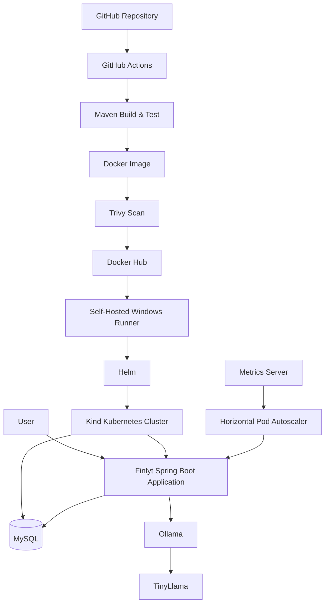

# Finlyt

<div align="center">

## DevSecOps Banking Application

**Finlyt** is a containerized banking application built with **Java 21, Spring Boot, Spring Security, MySQL, Docker, Kubernetes, Helm, GitHub Actions, and Ollama/TinyLlama**.

It demonstrates the complete journey from application development to containerization, security scanning, CI/CD, Kubernetes deployment, autoscaling, monitoring, and AI integration.

</div>

---

## 📌 Overview

Finlyt combines a Spring Boot banking application with a modern DevSecOps deployment workflow.

### Current workflow

```text
Developer
   │
   ▼
GitHub Repository
   │
   ▼
GitHub Actions
   │
   ├── Build & Test
   ├── Security / SAST checks
   ├── Docker Build
   ├── Trivy Container Scan
   └── Docker Hub Push
           │
           ▼
   Self-Hosted Windows Runner
           │
           ▼
      Kind Kubernetes
           │
     ┌─────┴─────┐
     ▼           ▼
  Finlyt       MySQL
     │
     ├── Spring Security
     ├── Transactions
     ├── Actuator Health
     └── Ollama / TinyLlama
     │
     ▼
 Kubernetes HPA
     │
     ▼
 Metrics Server
```

The project also contains earlier AWS/DevSecOps work in its history. The current deployment documented here is Kubernetes/Kind based.

---

# ✨ Features

## Banking Application

- User registration and login
- Spring Security authentication
- User accounts
- Account balances
- Deposits and withdrawals
- Transaction history
- Account-to-transaction relationship
- MySQL persistence
- JPA/Hibernate integration

## AI Integration

Finlyt also integrates with **Ollama** for local AI functionality.

Current model:

```text
tinyllama
```

Current configuration:

```properties
ollama.url=${OLLAMA_URL:http://localhost:11434}
ollama.model=tinyllama
```

The Ollama service can be run separately and accessed by the Spring Boot application through the configured URL.

## DevSecOps

- Git version control
- GitHub repository
- GitHub Actions CI/CD
- Maven build and verification
- Docker containerization
- Docker Hub image publishing
- Trivy container security scanning
- Kubernetes deployment
- Helm deployment
- Self-hosted Windows GitHub Actions runner
- Kubernetes HPA
- Kubernetes Metrics Server
- Deployment rollout verification
- Spring Boot Actuator health endpoint

---

# 🏗️ Architecture



---

# 🛠️ Technology Stack

| Technology | Purpose |
|---|---|
| Java 21 | Application runtime / language |
| Spring Boot | Backend framework |
| Spring Security | Authentication and authorization |
| Spring Data JPA | Database access |
| Hibernate | ORM |
| MySQL | Relational database |
| Maven | Build and dependency management |
| HTML / CSS / JavaScript | Application UI |
| Ollama | Local AI runtime |
| TinyLlama | Local AI model |
| Docker | Containerization |
| Docker Hub | Container image registry |
| Trivy | Container vulnerability scanning |
| Kubernetes | Container orchestration |
| Kind | Local Kubernetes cluster |
| Helm | Kubernetes packaging/deployment |
| GitHub Actions | CI/CD |
| Self-hosted Runner | Kubernetes deployment environment |
| HPA | Automatic application scaling |
| Metrics Server | Kubernetes CPU/memory metrics |
| Spring Boot Actuator | Application health monitoring |

---

# 📂 Project Structure

```text
Finlyt/
│
├── .github/
│   └── workflows/
│       └── ci-cd.yml
│
├── helm/
│   ├── Chart.yaml
│   ├── values.yaml
│   ├── .helmignore
│   └── templates/
│       ├── deployment.yaml
│       ├── service.yaml
│       ├── mysql.yaml
│       ├── hpa.yaml
│       └── _helpers.tpl
│
├── k8s/
│   ├── deployment.yaml
│   ├── service.yaml
│   ├── mysql.yaml
│   ├── hpa.yaml
│   └── secret.yaml
│
├── screenshots/
│   └── project screenshots
│
├── src/
│   ├── main/
│   │   ├── java/
│   │   │   └── com/example/bankapp/
│   │   │       ├── config/
│   │   │       ├── controller/
│   │   │       ├── model/
│   │   │       ├── repository/
│   │   │       └── service/
│   │   │
│   │   └── resources/
│   │       ├── static/
│   │       └── templates/
│   │
│   └── test/
│
├── Dockerfile
├── pom.xml
├── mvnw
├── mvnw.cmd
├── .gitignore
└── README.md
```

> `k8s/secret.yaml` should remain local and must not contain real credentials in Git.

---

# 🐳 Docker

Build the application image:

```bash
docker build -t guddu3447/finlyt:latest .
```

Run locally:

```bash
docker run -p 8080:8080 guddu3447/finlyt:latest
```

Docker image:

```text
guddu3447/finlyt
```

The CI/CD workflow can tag images using both `latest` and the Git commit SHA so that deployments can be traced back to a specific commit.

---

# 🔐 Container Security

The CI/CD workflow uses **Trivy** to scan the Docker image for vulnerabilities.

The scan focuses on:

```text
CRITICAL
HIGH
```

The current workflow is configured to report vulnerabilities without automatically stopping the pipeline for unfixed findings.

This keeps security scanning visible while allowing the deployment workflow to continue where appropriate.

---

# ☸️ Kubernetes

Finlyt currently runs on a **Kind Kubernetes cluster**.

Check the current context:

```powershell
kubectl config current-context
```

Expected cluster context:

```text
kind-finlyt-cluster
```

Check the cluster:

```powershell
kubectl get nodes
```

Check application pods:

```powershell
kubectl get pods
```

Check deployments:

```powershell
kubectl get deployments
```

---

# 🚀 Finlyt Deployment

The application is deployed as:

```text
Deployment: finlyt
```

Check the deployed image:

```powershell
kubectl get deployment finlyt -o jsonpath="{.spec.template.spec.containers[0].image}"
```

The current deployment uses:

```text
guddu3447/finlyt:latest
```

Check image pull policy:

```powershell
kubectl get deployment finlyt -o jsonpath="{.spec.template.spec.containers[0].imagePullPolicy}"
```

The deployment has been configured with:

```text
Always
```

This ensures Kubernetes checks the registry when a new pod is started.

Restart the deployment:

```powershell
kubectl rollout restart deployment/finlyt
```

Verify rollout:

```powershell
kubectl rollout status deployment/finlyt
```

---

# 📦 Helm

Helm is used to package and deploy the Kubernetes resources.

```text
helm/
├── Chart.yaml
├── values.yaml
└── templates/
    ├── deployment.yaml
    ├── service.yaml
    ├── mysql.yaml
    ├── hpa.yaml
    └── _helpers.tpl
```

Validate the chart:

```bash
helm lint helm
```

Render templates:

```bash
helm template finlyt helm
```

Install or upgrade:

```bash
helm upgrade --install finlyt helm
```

Check releases:

```bash
helm list
```

---

# 📈 Horizontal Pod Autoscaling

Finlyt uses Kubernetes **Horizontal Pod Autoscaler**.

Configuration:

```text
Minimum replicas: 2
Maximum replicas: 5
CPU target:       70%
```

Check HPA:

```powershell
kubectl get hpa
```

Example verified state:

```text
finlyt-hpa   Deployment/finlyt   cpu: 3%/70%   2   5   2
```

This means the application normally runs with at least two replicas and Kubernetes can scale it up to five replicas when CPU usage increases.

---

# 📊 Kubernetes Metrics Server

The HPA requires resource metrics.

Finlyt's Kind cluster is configured with **Metrics Server**.

Check:

```powershell
kubectl get pods -n kube-system | findstr metrics-server
```

Check node resource usage:

```powershell
kubectl top nodes
```

Check application resource usage:

```powershell
kubectl top pods
```

Example verified output:

```text
NAME                         CPU(cores)   MEMORY(bytes)
finlyt-xxxxx                 3m           220Mi
finlyt-xxxxx                 4m           222Mi
finlyt-mysql-xxxxx           42m          431Mi
```

Example node metrics:

```text
CPU:       1486m
CPU usage: 12%
Memory:    1604Mi
Memory:    20%
```

The Metrics Server required a kubelet TLS configuration adjustment for the Kind environment. The working configuration uses:

```text
--kubelet-insecure-tls
```

After the fix, `kubectl top nodes`, `kubectl top pods`, and HPA CPU metrics became available.

---

# 🗄️ MySQL

MySQL runs inside Kubernetes.

```text
Service:   finlyt-mysql
Database:  bankappdb
Port:      3306
```

Check MySQL:

```powershell
kubectl get pods | findstr mysql
```

Check the service:

```powershell
kubectl get service finlyt-mysql
```

The application database currently contains:

```text
accounts
transactions
```

### Accounts

```text
id
username
password
balance
```

### Transactions

```text
id
amount
timestamp
type
account_id
```

Relationship:

```text
Account
   │
   └── 1 : Many ──> Transactions
```

---

# 🔗 Database Configuration

The Spring Boot application uses environment variables for database configuration:

```properties
spring.datasource.url=jdbc:mysql://${MYSQL_HOST:localhost}:${MYSQL_PORT:3306}/${MYSQL_DATABASE:bankappdb}?useSSL=false&allowPublicKeyRetrieval=true
spring.datasource.username=${MYSQL_USER:root}
spring.datasource.password=${MYSQL_PASSWORD:Test@123}
spring.datasource.driver-class-name=com.mysql.cj.jdbc.Driver
```

For deployed environments, credentials should be provided through Kubernetes Secrets or another secure secret-management mechanism.

---

# 🧩 JPA / Hibernate

The deployed application uses:

```properties
spring.jpa.hibernate.ddl-auto=validate
```

This is intentional for the deployed environment: Hibernate validates the existing schema instead of modifying it automatically.

The CI workflow can use:

```text
SPRING_JPA_HIBERNATE_DDL_AUTO=update
```

for a fresh CI MySQL database so that tests can initialize the schema.

---

# 🤖 Ollama + TinyLlama

Finlyt includes local AI integration through Ollama.

Check Ollama:

```powershell
curl.exe http://localhost:11434/api/tags
```

The configured model is:

```text
tinyllama:latest
```

Current application configuration:

```properties
# Ollama AI
ollama.url=${OLLAMA_URL:http://localhost:11434}
ollama.model=tinyllama
```

The AI runtime is intentionally kept separate from the core database and Kubernetes application services.

---

# ❤️ Actuator Health

Finlyt exposes a restricted Spring Boot Actuator health endpoint.

```properties
management.endpoints.web.exposure.include=health
management.endpoint.health.show-details=when-authorized
```

Only the health endpoint is exposed rather than exposing unnecessary management endpoints.

---

# 🔄 CI/CD Pipeline

Workflow:

```text
.github/workflows/ci-cd.yml
```

## Continuous Integration

The pipeline performs the application build and verification process:

```text
Checkout
   ↓
Java 21
   ↓
Maven
   ↓
Build & Test
   ↓
Docker Build
   ↓
Trivy Scan
   ↓
Docker Hub Login
   ↓
Docker Image Push
```

For CI's fresh MySQL environment, the workflow provides:

```text
MYSQL_HOST
MYSQL_PORT
MYSQL_DATABASE
MYSQL_USER
MYSQL_PASSWORD
SPRING_JPA_HIBERNATE_DDL_AUTO=update
```

---

# 🚢 Continuous Deployment

The deployment stage runs on the self-hosted Windows runner.

```text
CI succeeds
     ↓
Self-Hosted Windows Runner
     ↓
Kubernetes configuration
     ↓
kubectl verification
     ↓
Helm validation
     ↓
Helm deployment
     ↓
Rollout verification
     ↓
Deployment verification
```

The runner uses a kubeconfig stored outside the repository:

```text
C:\actions-runner\kubeconfig
```

---

# 🖥️ Self-Hosted GitHub Actions Runner

The project uses a self-hosted Windows runner for the Kubernetes deployment stage.

Runner environment:

```text
self-hosted
Windows
X64
```

The runner has access to the local Kind cluster.

The kubeconfig is kept outside Git:

```text
C:\actions-runner\kubeconfig
```

This allows the CI/CD workflow to deploy to the local Kubernetes environment without committing cluster credentials to the repository.

---

# 🔑 Secrets & Security

Sensitive information should never be committed to Git.

Examples:

```text
Passwords
API keys
Tokens
Kubeconfig files
Private keys
Database credentials
```

Kubernetes secrets should be supplied separately.

Example structure:

```yaml
apiVersion: v1
kind: Secret
metadata:
  name: finlyt-secret
type: Opaque
stringData:
  MYSQL_ROOT_PASSWORD: <your-password>
  MYSQL_PASSWORD: <your-password>
```

---

# 🧪 Verification & Troubleshooting

### Check application logs

```powershell
kubectl logs deployment/finlyt
```

### Check application startup

```powershell
kubectl logs deployment/finlyt | findstr /i "Started BankappApplication"
```

### Check for database schema problems

```powershell
kubectl logs deployment/finlyt | findstr /i "Duplicate foreign"
```

### Check HPA

```powershell
kubectl get hpa
```

### Check metrics

```powershell
kubectl top nodes
kubectl top pods
```

### Check rollout

```powershell
kubectl rollout status deployment/finlyt
```

### Check all important resources

```powershell
kubectl get pods
kubectl get deployments
kubectl get services
kubectl get hpa
```

---

# 🖼️ Screenshots

Project screenshots are maintained in:

```text
screenshots/
```

The repository contains useful screenshots from the application, deployment, CI/CD, Kubernetes, and project development stages.

Older AWS-only screenshots are not treated as the primary documentation for the current implementation.

---

# 🕰️ Project Evolution

Finlyt has gone through multiple development stages.

### Earlier stage

The earlier project work included AWS-oriented DevSecOps components and deployment work.

### Current stage

The project has evolved toward a Kubernetes-focused implementation with:

- Kind Kubernetes cluster
- Helm
- Kubernetes Deployment
- Kubernetes Services
- MySQL inside Kubernetes
- HPA
- Metrics Server
- Self-hosted Windows runner
- GitHub Actions deployment
- Docker Hub image publishing
- Trivy scanning
- Ollama / TinyLlama
- Actuator health monitoring
- Stricter deployed database schema validation
- CI-specific database initialization

This README focuses primarily on the current implementation while retaining the useful DevSecOps concepts from the earlier project.

---

# 📋 Current Deployment Summary

| Component | Current Setup |
|---|---|
| Application | Finlyt |
| Backend | Spring Boot |
| Java | 21 |
| Database | MySQL |
| Database | `bankappdb` |
| Container Registry | Docker Hub |
| Image | `guddu3447/finlyt:latest` |
| Container Security | Trivy |
| Kubernetes | Kind |
| Package Manager | Helm |
| Minimum Replicas | 2 |
| Maximum Replicas | 5 |
| HPA CPU Target | 70% |
| Metrics | Metrics Server |
| CI/CD | GitHub Actions |
| Deployment Runner | Self-hosted Windows |
| AI Runtime | Ollama |
| AI Model | TinyLlama |
| Health Monitoring | Spring Boot Actuator |

---

# 💡 Key DevSecOps Concepts Demonstrated

- Git-based development
- GitHub source control
- CI/CD automation
- Maven build automation
- Automated testing
- Docker containerization
- Docker image versioning
- Docker Hub publishing
- Trivy vulnerability scanning
- Kubernetes deployments
- Kubernetes services
- Kubernetes secrets
- Kubernetes readiness checks
- Helm chart development
- Helm deployment
- Horizontal Pod Autoscaling
- Metrics Server
- Self-hosted GitHub Actions runners
- Kind Kubernetes clusters
- Rollout verification
- Resource monitoring
- Secure application configuration
- Local AI integration with Ollama

---

# 👨‍💻 Author

## Aarav Yadav

**B.Tech Computer Science & Engineering**

---

# 🤝 Contributions & Project History

The repository contains work from different stages of the project.

Earlier AWS/DevSecOps work was developed with help from **Samir Patel** and is part of the project's history.

The current implementation and the newer Kubernetes, Helm, HPA, Metrics Server, CI/CD, Ollama, and application improvements are documented here as the present state of Finlyt.

---

<div align="center">

### Finlyt

**Java • Spring Boot • MySQL • Docker • Kubernetes • Helm • GitHub Actions • Ollama**

</div>
